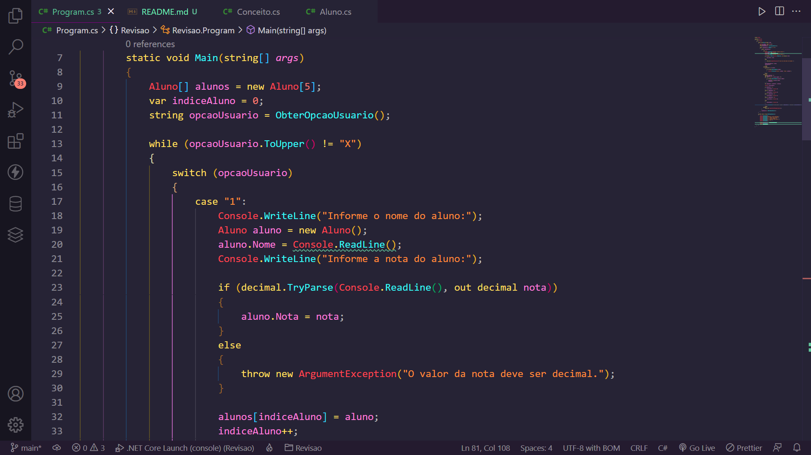

# Aplicação para cadastro de notas de alunos e cálculo de média geral utilizando C#

## Visão Geral

### Screenshot

## Meu processo

### Construído com

-   C#
-   .NET 6.0

### O que aprendi

Neste projeto eu pude aplicar os conhecimentos obtidos sobre C# e .NET junto ao Bootcamp Impulse da Digital Innovation One para desenvolver uma simples aplicação de console.

## Autor

-   GitHub - Vinícius dos Santos Verissimo (https://github.com/viniciusdsv93)
